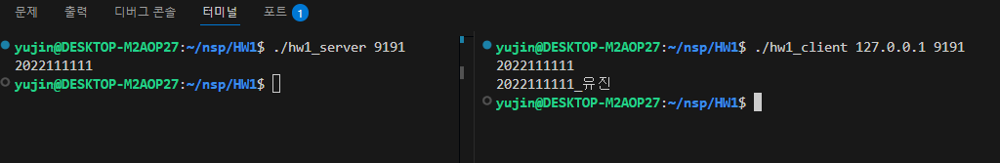

# HW1 - Basic TCP Socket Programming

이 과제는 TCP 소켓 프로그래밍의 기본 구조를 익히기 위한 실습으로, 클라이언트가 학번을 서버에 전송하면, 서버는 해당 학번에 본인의 이름을 덧붙여 다시 클라이언트에 전송하는 구조입니다.
<br><br>

## 전체 흐름

- **Client**:
  - 서버에 연결 요청

  - 자신의 학번을 `write()`로 서버로 전송

  - 서버로부터 학번 + 이름 형태의 문자열을 `read()`로 받아 출력

- **Server**:
  - 클라이언트의 연결 요청 수락

  - 클라이언트로부터 `read()`로 학번을 수신하여 출력

  - 해당 학번에 `_이름`을 덧붙인 문자열을 클라이언트에 `write()`로 전송
<br><br>


## 실행 방법

1. 서버 실행

   ```bash
   gcc hw1_server.c -o server
   ./server 9190
   ```

2. 클라이언트 실행 
    
   ```bash
   gcc hw1_client.c -o client
    ./client 127.0.0.1 9190
   ```
<br><br>

## 구현 결과
   