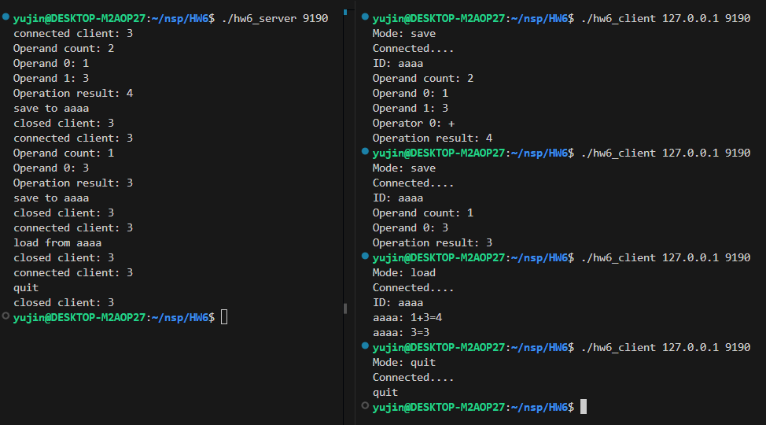
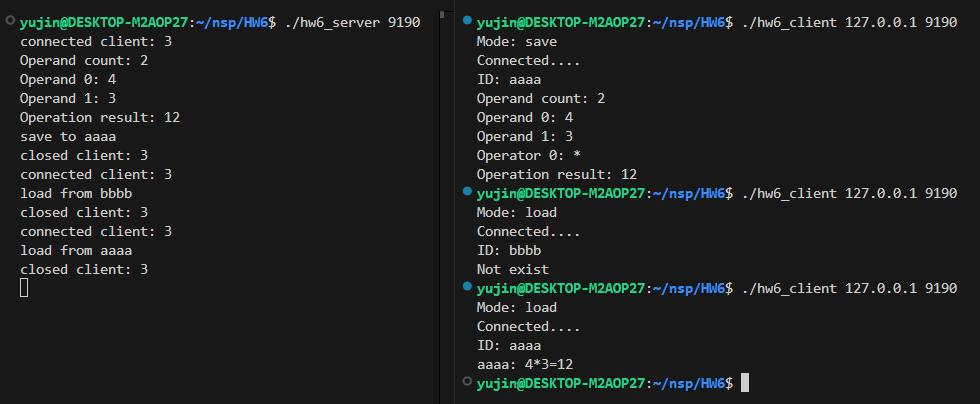

# HW6 - Multiplexing Calculator Server 
이 과제는 `select()`, `pipe()`, `writev()`, `readv()` 시스템 호출을 이용하여 멀티플렉싱 기반 TCP 계산기 서버와 클라이언트를 구현한 과제입니다.

서버는 여러 클라이언트의 요청을 동시에 처리하고, 계산 로그 관리는 자식 프로세스를 통해 수행합니다.
<br><br>

## 전체 흐름 

- **Parent process (server)**:
  - `select()`를 사용하여 여러 클라이언트와 동시에 통신
  
  - 파이프(pipe)를 통해 자식 프로세스와 메시지를 주고받으며 계산 로그를 저장하거나 로드

- **Child process**:
  - 부모 프로세스로부터 전달받은 메시지에 따라 계산 로그를 메모리에 저장하거나 조회

- **Client**:
  - 서버에 연결하여 연산 요청(`save`, `load`, `quit`)을 전송
<br><br>

## Server-Client 통신 구조 
Client는 Server에 3개의 벡터 전송
- `vec[0]`: mode (`save`, `load`, `quit`)

- `vec[1]`: ID (길이 4 고정)

- `vec[2]`: 계산 데이터 (`피연산자 수 + 피연산자 + 연산자`, 예: `3123++`)
<br><br>

## 세부 로직 -  Server ('hw6_server.c')
**> Parent Process** 
- `readv()` 함수로 Client의 3가지 데이터(mode/id/calc_data)를 분할하여 수신 

- `mode`에 따라 동작 구분 
  - `save`:
    - 계산식을 파싱하여 결과를 계산 (`3123++` → `1+2+3=6`)
   
    - `ID 수식=결과` 형태로 자식 프로세스에 전달 (예: aaaa 1+2+3=6)
  - `load`:
    - ID를 자식 프로세스에 요청하여 해당 ID의 계산 기록을 받아온 뒤 클라이언트에 전달
  - `quit`:
    - 자식 프로세스에 종료 명령을 보내고, 자식 종료 후 부모 프로세스도 종료
    
**> Child Process**
- 부모로부터 파이프를 통해 전달받은 메시지 처리

- `mode`에 따라 동작 구분 
    - `save`: 
        - 전달받은 계산 로그를 ID별로 메모리에 저장
    - `load`: 
        - 요청받은 ID로 저장된 수식을 검색하여 결과를 반환, 없으면 `"Not exist"` 반환
    - `quit`: 
        - `exit(0)`으로 종료
<br><br>

## 세부 로직 -  Client ('hw6_client.c')
- 서버에 연결하기 전 사용자로부터 `mode`를 입력받음 (connected....)

- `mode`에 따라:
  - `save`:
    - vec[0]에 mode, vec[1]에 ID, vec[2]에 계산 정보 입력받아 `writev()`로 전송
   
    - 서버로부터 연산 결과를 받아 출력하고 종료 (Operation result: ___ )
  - `load`:
    - vec[0]에 mode, vec[1]에 ID 입력받아 `writev()`로 전송
    
    - 서버로부터 과거 계산 기록을 read()로 받아 출력
  - `quit`:
    - vec[0]에 mode 입력 받아 서버에게 `quit` 명령어를 보내고 연결 종료
<br><br>  

## 예외 처리 
1. mode 값 유효한지 확인 (save, load, quit 외 입력 시 server 연결 전 종료)
    - supported mode: save load quit

2. ID는 4글자 고정 
    - Error: ID length must be 4

3. save 모드에서 피연산자 수가 0 이하이면 종료
    - Overflow will happen(연산자 수 정보)
<br><br>
* 서버에 데이터를 `writev()`로 전송하고, 서버 응답을 받아 출력
<br><br>

## 실행 방법

1. server 실행 
   ```bash
   cd HW6
   gcc hw6_server.c -o server
   ./server 9190 
   ```
   <br>

2. client 실행
   ```bash
   cd HW6
   gcc hw6_client.c -o client
   ./client 127.0.0.1 9190
   ```
   <br>

## 구현 결과
### 1.


### 2.

