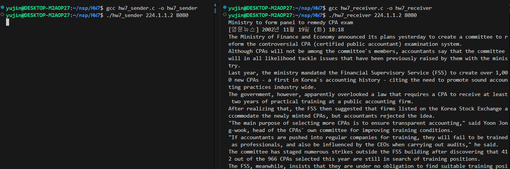
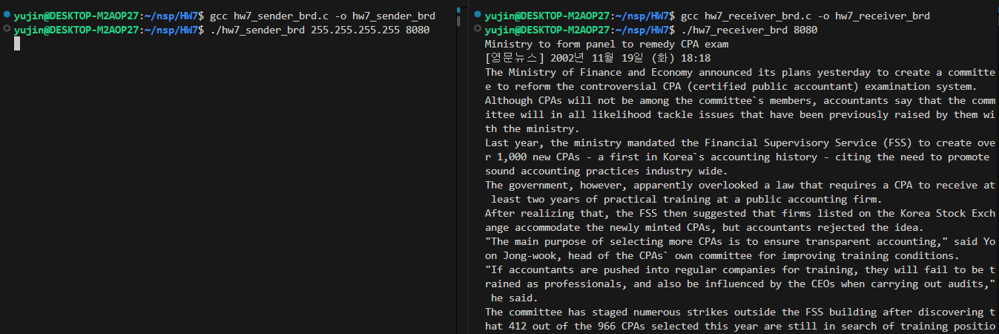

# HW7 - Multicast & Broadcast UDP 송수신

UDP 기반의 **멀티캐스트(Multicast)** 및 **브로드캐스트(Broadcast)** 송수신 프로그램을 구현하여, `news.txt` 파일을 읽어 메시지로 전송하는 과제입니다.
<br><br>

## 파일 구성

- `hw7_sender.c` / `hw7_receiver.c` : Multicast 방식 

- `hw7_sender_brd.c` / `hw7_receiver_brd.c` : Broadcast 방식

- `news.txt` : 전송할 텍스트 데이터

- `*.png` : 실행 결과 사진
<br><br>

## 세부 로직

### 1. Multicast 

- **Sender**

  - `setsockopt()`로 TTL(Time-To-Live) 설정

  - `sendto()`로 지정된 그룹 IP로 메시지 송신

- **Receiver**

  - `setsockopt()`로 `IP_ADD_MEMBERSHIP` 설정하여 멀티캐스트 그룹 가입

  - `recvfrom()`으로 메시지 수신


### 2. Broadcast 

- **Sender**

  - `setsockopt()`로 `SO_BROADCAST` 설정

  - `sendto()`로 브로드캐스트 주소(`255.255.255.255`)에 송신

- **Receiver**

  - 해당 포트로 들어오는 메시지를 `recvfrom()`으로 수신
<br><br>

## 실행 방법
### 1. Multicast 

```bash
gcc hw7_sender.c -o sender
gcc hw7_receiver.c -o receiver

# 수신자 먼저 실행
./receiver 224.1.1.2 8080

# 송신자 실행
./sender 224.1.1.2 8080
```

### 2. Broadcast 

```bash
gcc hw7_sender_brd.c -o sender_brd
gcc hw7_receiver_brd.c -o receiver_brd

# 수신자 먼저 실행
./receiver_brd 8080

# 송신자 실행
./sender_brd 255.255.255.255 8080
```
<br><br>

## 구현 결과

### 1. Multicast


### 2. Broadcast

