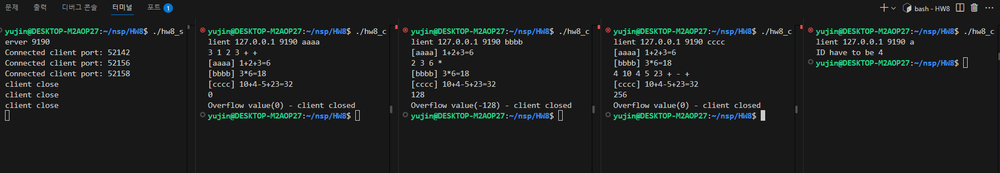

# HW8 - Multithread Calculator Server  
이 과제는 `pthread`, `writev()`, `readv()`, `iovec`를 이용하여 **멀티스레드 기반 TCP 계산기 서버와 클라이언트**를 구현한 과제입니다.

- 서버는 클라이언트의 연산 요청을 처리한 뒤, 결과를 **모든 클라이언트에게 브로드캐스트**

- 연산 요청은 수식 문자열로 입력되며, 각 클라이언트는 고유 ID(4글자)를 가짐
<br><br>

## 전체 흐름

- **Server**:
  - 클라이언트 접속 시마다 `pthread`로 스레드를 생성하여 처리

  - 클라이언트로부터 `ID + 수식 문자열`을 `readv()`로 수신

  - 수식을 계산한 결과를 모든 클라이언트에게 `write()`로 전송

- **Client**:
  - 사용자로부터 수식 입력 후 서버로 전송

  - 서버로부터 브로드캐스트된 결과를 수신하여 출력

  - 오버플로우 입력(`128 이상`, `0`, `255 초과`) 시 자동 종료
<br><br>

## Server-Client 통신 구조

클라이언트는 서버에 `2개의 벡터`로 요청을 전송함

- `vec[0]`: 고정 길이 ID (4글자)

- `vec[1]`: 수식 요청 문자열 (`피연산자 수 + 피연산자 + 연산자`, 예: `3 1 2 3 + +`)

서버는 해당 수식을 계산 후 `[ID] 수식=결과` 형식으로 모든 클라이언트에게 전송함
<br><br>

## 세부 로직 - Server (`hw8_server.c`)

- `readv()`로 ID와 수식 문자열을 동시에 수신

- `calculate_expr()` 함수를 통해 수식 파싱 및 계산

- 결과는 `[id] 수식=결과` 형식으로 구성하여 모든 클라이언트에게 전송

- 오버플로우(피연산자 수 초과/0 등) 발생 시 클라이언트에 종료 메시지 전송 후 연결 해제

- 클라이언트 연결 해제/자원 정리 완료시 `client close` 출력
<br><br>

## 세부 로직 - Client (`hw8_client.c`)

- 실행 시 IP, PORT, ID(4글자)를 인자로 입력

- 사용자 입력을 `vec[1]`에 담아 `writev()`로 서버에 전송

- 피연산자 수가 `0`, `128 이상`, `255 초과`일 경우 → 오버플로우 감지 후 종료

- 서버로부터의 결과는 `read()`를 통해 수신하고 바로 출력
<br><br>

## 예외 처리

1. **ID는 반드시 4글자**  
   - `ID have to be 4` 출력 후 종료

2. **입력 형식 오류 또는 오버플로우**  
   - 피연산자 수가 1바이트 부호형 범위를 넘거나 0인 경우:  
     `Overflow value(-128) - client closed`

3. **클라이언트 종료 시**  
   - 서버는 `client close` 메시지 출력
<br><br>

## 실행 방법

1. Server 실행
```bash
gcc hw8_server.c -o server -lpthread
./server 9190
```

2. Client 실행
```bash
gcc hw8_client.c -o client -lpthread
./client 127.0.0.1 9190 aaaa
```
<br><br>

## 구현 결과

